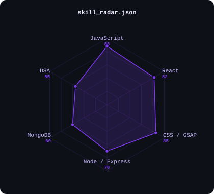
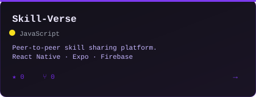
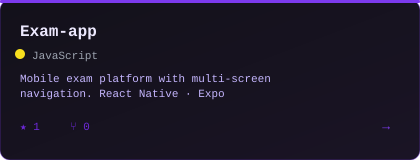

<picture>
  <source media="(prefers-color-scheme: dark)"  srcset="assets/portrait-dark.svg">
  <source media="(prefers-color-scheme: light)" srcset="assets/portrait-light.svg">
  
</picture>

 

 

&nbsp;

&nbsp;

  

---

Hey, I'm **Shagirth** — a web developer who obsesses over the gap between functional and beautiful.

- Building **[ContentForge](https://github.com/Shagi24)** — AI-powered recording-to-content pipeline
- Frontend-first: **GSAP, Lenis, React** — things that feel as good as they look
- Backend growing: **Node/Express + MongoDB** — enough to ship full products
- Part of **The Unknowns** — a competition team that actually competes

---

## toolbox

---

## skill radar

<picture>
  <source media="(prefers-color-scheme: dark)"  srcset="assets/radar-dark.svg">
  <source media="(prefers-color-scheme: light)" srcset="assets/radar-light.svg">
  
</picture>

---

## contribution graph

<picture>
  <source media="(prefers-color-scheme: dark)"  srcset="https://raw.githubusercontent.com/Shagi24/Shagi24/output/snake-dark.svg">
  <source media="(prefers-color-scheme: light)" srcset="https://raw.githubusercontent.com/Shagi24/Shagi24/output/snake-light.svg">
  
</picture>

---

## metrics

---

## projects

<table><tr>

<td width="50%" align="center">
  <a href="https://github.com/Shagi24/Skill-Verse">
    <picture>
      <source media="(prefers-color-scheme: dark)"  srcset="assets/card-skill-verse-dark.svg">
      <source media="(prefers-color-scheme: light)" srcset="assets/card-skill-verse-light.svg">
      
    </picture>
  </a>
</td>

<td width="50%" align="center">
  <a href="https://github.com/Shagi24/Exam-app">
    <picture>
      <source media="(prefers-color-scheme: dark)"  srcset="assets/card-exam-app-dark.svg">
      <source media="(prefers-color-scheme: light)" srcset="assets/card-exam-app-light.svg">
      
    </picture>
  </a>
</td>

</tr></table>

  <a href="https://github.com/Shagi24/Skill-Verse">Skill-Verse</a> · React Native · Firebase &nbsp;|&nbsp;
  <a href="https://github.com/Shagi24/Exam-app">Exam-app</a> · React Native · Expo

